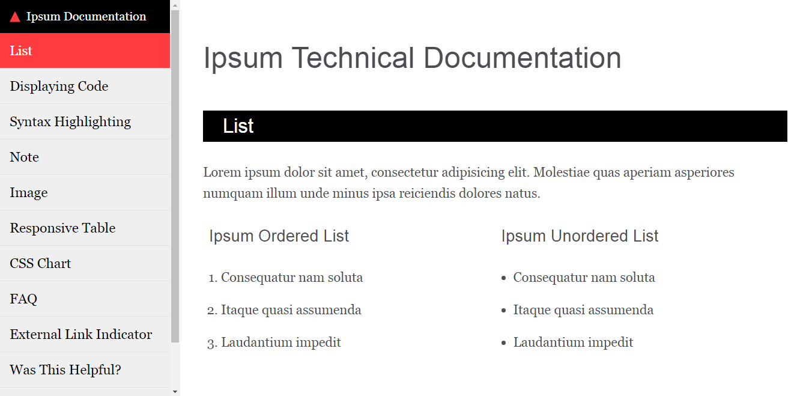
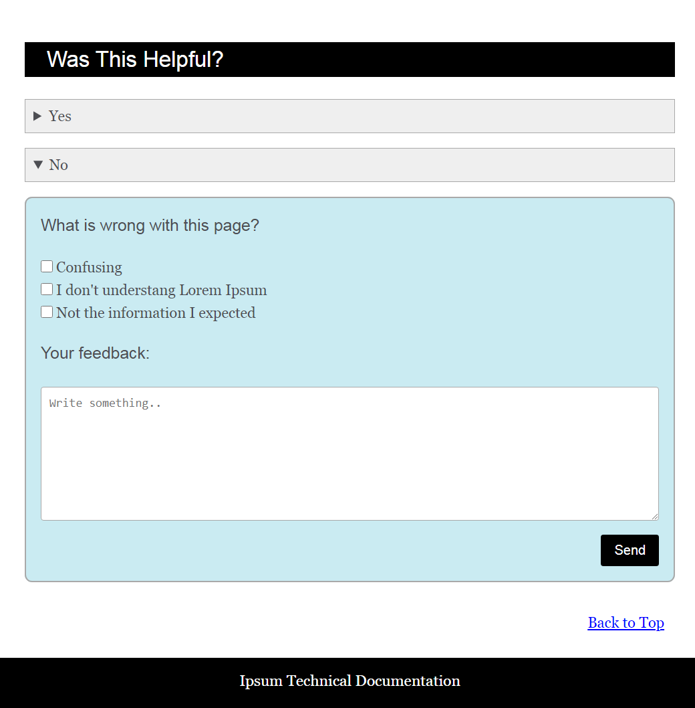

# Technical-Documentation-Webpage-Template
An example of one-page technical documentation. Built without using Framework and JavaScript, just pure HTML and CSS. I created for the course on learning responsive web design. It uses CSS Checkbox hack on the responsive navbar to show/hide vertical navigation (menu), and Semantic HTML 5 on the main section.

Feel free to replace the dummy text Lorem Ipsum. Change color themes. Remove/add features, and modify the code to suit your own needs.

## Desktop View

## Mobile Navbar View

## Mobile Menu View

## Feedback Desktop View

